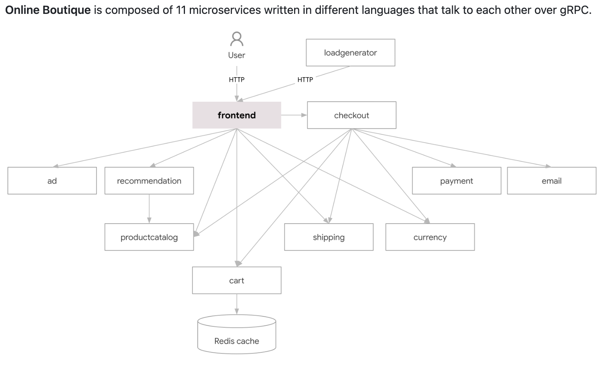

# kind Playbook

- kind (Kubernetes IN Docker) is a tool for running local Kubernetes clusters using Docker container “nodes”.
- kind was primarily designed for testing Kubernetes itself, but may be used for local development or CI.
- kind uses `kubeadm` to create clusters, and it supports multi-node clusters.

<br/>

### Phase #1 : Setup Single Node Cluster & Deploy WordPress

- Install

```bash
# Mac OS
# via homebrew (https://brew.sh/)
brew install kind
```

```bash
# Windows
> Get-ExecutionPolicy
Restricted
> Set-ExecutionPolicy AllSigned
> Get-ExecutionPolicy
AllSigned

# Install Chocolatey (https://chocolatey.org/install)
> Set-ExecutionPolicy Bypass -Scope Process -Force; [System.Net.ServicePointManager]::SecurityProtocol = [System.Net.ServicePointManager]::SecurityProtocol -bor 3072; iex ((New-Object System.Net.WebClient).DownloadString('https://community.chocolatey.org/install.ps1'))

# If you don't see any errors, you are ready to use Chocolatey! Type choco or choco -?
```

- Make 1 single node cluster

```bash
kind create cluster --name kind-single-node
```

- kubectl cheetsheet

  - <https://kubernetes.io/docs/reference/generated/kubectl/kubectl-commands>
  - <https://kubernetes.io/ko/docs/reference/kubectl/cheatsheet/>

- Check config file

```bash
cat ~/.kube/config
kubectl config view
```

- Check cluster

```bash
kubectl cluster-info --context kind-kind-single-node
```

- Check nodes

```bash
kubectl get nodes
```

- Check pods

```bash
kubectl get pods --all-namespaces
```

- Check ALL

```bash
kubectl get all --all-namespaces
```

- Deploy WordPress App Using Helm

```bash
# Add Helm Repo
helm repo add bitnami https://charts.bitnami.com/bitnami

# Update Helm Repo
helm repo update

# Deploy WordPress
helm install my-wordpress bitnami/wordpress

# List your Helm Chart
helm list
```

- Check WordPress

```bash
kubectl get all
```

- Port Forwarding

```bash
kubectl port-forward svc/my-wordpress 8080:80
```

<br/>

### Phase #2 : Understanding Persistent Volume & Persistent Volume Claim

- PVC (Persistent Volume Claim)

```bash
kubectl apply -f ./pvc.yaml

# Check PVC
kubectl get pv,pvc
kubectl get pods
```

- Deploy busybox with PVC

```bash
kubectl apply -f ./busybox.yaml
```

<br/>

### Phase #3 : Deploy Multi-Node Cluster

- Delete the single node cluster

```bash
kind delete cluster --name kind-single-node
```

- Deploy Multi-Node Cluster

```bash
kind create cluster --name kind-multi-node-test --config ./kind-multi-node-config.yaml
```

- Install k9s : K8s CLI To Manage Your Clusters In Style!

```bash
# Mac OS
brew install k9s

# Windows
choco install k9s
```

- K8s Dashboard Deploy (<https://github.com/kubernetes/dashboard/tree/master>)

```bash
# Directly (Not recommended)
kubectl apply -f https://raw.githubusercontent.com/kubernetes/dashboard/v2.0.0-beta8/aio/deploy/recommended.yaml

# Save to file and apply (Recommended)
wget https://raw.githubusercontent.com/kubernetes/dashboard/v2.7.0/aio/deploy/recommended.yaml -O dashboard.yaml
kubectl apply -f dashboard.yaml

# Docs: https://github.com/kubernetes/dashboard/blob/master/docs/user/access-control/creating-sample-user.md
kubectl apply -f dashboard-admin-user.yaml
kubectl apply -f cluster-role-binding.yaml
kubectl -n kubernetes-dashboard create token admin-user
{token} # Copy the token
kubectl proxy
Go to http://localhost:8001/api/v1/namespaces/kubernetes-dashboard/services/https:kubernetes-dashboard:/proxy/

```

- Deploy Nginx

```bash
kubectl apply -f https://k8s.io/examples/application/deployment.yaml

# Expose Nginx
kubectl expose deployment nginx-deployment --type NodePort

kubectl port-forward service/nginx-deployment 8000:80
```

- Deploy GCP microservices demo

> <https://github.com/GoogleCloudPlatform/microservices-demo.git>



```bash
git clone https://github.com/GoogleCloudPlatform/microservices-demo.git
cd microservices-demo/
kubectl apply -f ./release/kubernetes-manifests.yaml
kubectl port-forward service/frontend-external 8080:80
```

- Clean Up

```bash
kubectl delete deployment nginx-deployment
...
kind delete cluster --name kind-multi-node-test
```
