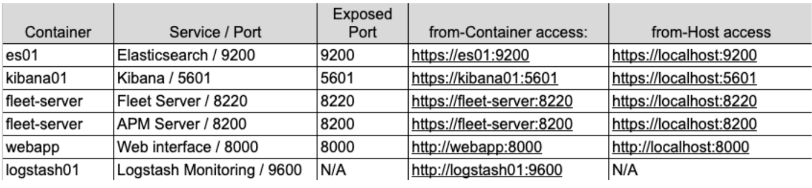

# Getting started with the Elastic Stack and Docker Compose: Part 2

## Elastic Agent, Fleet, and Elastic APM




## Commands

```bash
docker cp es-cluster-es01-1:/usr/share/elasticsearch/config/certs/ca/ca.crt ./tmp/.
openssl x509 -fingerprint -sha256 -noout -in ./tmp/ca.crt | awk -F"=" {' print $2 '} | sed s/://g

# and paste ca.crt
ssl:
  certificate_authorities:
    - |
      -----BEGIN CERTIFICATE-----
```


## Resources

### Fleet/Agent

Overview: https://www.elastic.co/guide/en/fleet/current/fleet-overview.html

Policy Creation, No UI: https://www.elastic.co/guide/en/fleet/current/create-a-policy-no-ui.html

Adding Fleet On-Prem: https://www.elastic.co/guide/en/fleet/current/add-fleet-server-on-prem.html

Agent in a Container: https://www.elastic.co/guide/en/fleet/current/elastic-agent-container.html

Air Gapped: https://www.elastic.co/guide/en/fleet/current/air-gapped.html

Secure Fleet: https://www.elastic.co/guide/en/fleet/current/secure-connections.html

### APM

APM:
https://www.elastic.co/guide/en/apm/guide/current/upgrade-to-apm-integration.html

On Prem: https://www.elastic.co/guide/en/apm/guide/current/apm-integration-upgrade-steps.html

Fleet-Managed: https://www.elastic.co/guide/en/fleet/8.8/install-fleet-managed-elastic-agent.html

Queue Full Error:
https://www.elastic.co/guide/en/apm/server/current/common-problems.html#queue-full
